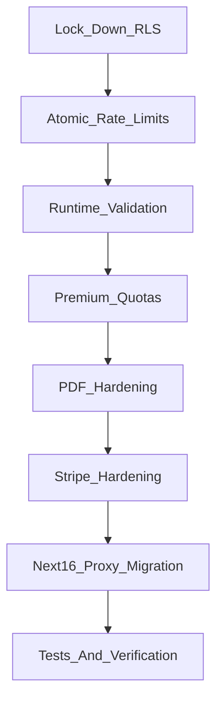

# App Hardening Review Plan

## Review Context

- Scope: current app on `main`; `git diff` is empty and the delegated `code-reviewer` confirmed there is no reviewable working-tree diff.
- Verified current baseline: `npm run lint && npm run typecheck` passes.
- No automated tests exist yet, so this plan includes adding focused coverage for the risky paths.

## Highest Priority Findings

- **High: Supabase RLS permits direct authenticated writes to paid tables.** The current `FOR ALL` owner policies in [supabase/migrations/20250502000000_init_schema.sql](supabase/migrations/20250502000000_init_schema.sql) and [supabase/migrations/20250502120000_document_chunks.sql](supabase/migrations/20250502120000_document_chunks.sql) let any authenticated user write `documents` and `document_chunks` through the public anon API, bypassing app-level Premium upload checks.
- **High: anonymous rate limiting is raceable and can fall back open in production.** [lib/usage/anonymous-rate-limit.ts](lib/usage/anonymous-rate-limit.ts) reads a counter, then writes the next value, so concurrent requests can exceed the daily limit. It also uses in-memory counters when `SUPABASE_SERVICE_ROLE_KEY` is missing.
- **High: Premium AI/PDF paths lack quotas.** [app/api/chat/premium/route.ts](app/api/chat/premium/route.ts), [app/api/documents/[id]/analyze/route.ts](app/api/documents/[id]/analyze/route.ts), and [app/api/documents/route.ts](app/api/documents/route.ts) gate by subscription, but do not cap request frequency, token-heavy chat calls, or CPU-heavy PDF parsing.
- **Medium: chat payloads are runtime-trusted.** [app/api/chat/premium/route.ts](app/api/chat/premium/route.ts) casts request JSON to `ChatTurn[]`; a malicious caller can send huge histories or unexpected roles such as `system`, which are forwarded to the LLM at runtime.
- **Medium: Stripe checkout and analysis routes need stricter validation and safer errors.** [app/api/stripe/checkout/route.ts](app/api/stripe/checkout/route.ts) returns raw exception messages; [app/api/documents/[id]/analyze/route.ts](app/api/documents/[id]/analyze/route.ts) only partially validates the JSON body.
- **Medium: PDF upload validation is late and MIME-based.** Anonymous and Premium upload routes call `formData()`/`arrayBuffer()` before enough early rejection, and MIME type is client-controlled.
- **Low/Medium: Next.js 16 deprecates `middleware.ts`.** [middleware.ts](middleware.ts) should migrate to `proxy.ts` with an exported `proxy` function, per the installed Next 16 upgrade docs.
- **Low: Supabase trigger hardening.** `public.handle_new_user()` is a `SECURITY DEFINER` function in an exposed schema with `search_path = public`; harden it with explicit schema qualification and restricted execution.

## Fix Plan

1. **Lock down Supabase write access.**
  - Add a new migration that replaces broad `FOR ALL` policies with separate owner `SELECT` and safe `DELETE` policies.
  - Remove direct authenticated `INSERT`/`UPDATE` on `documents` and `document_chunks`.
  - Move Premium document/chunk writes in [app/api/documents/route.ts](app/api/documents/route.ts) to a server-only service-role helper after `getUser()` and `requirePremiumAccess()` pass.
  - Review `usage_events`; either make it server-only or add tight constraints if client inserts are still needed.
2. **Make anonymous rate limiting atomic and production-safe.**
  - Add a service-role-only SQL function/RPC that increments `anonymous_usage_daily` with one atomic `INSERT ... ON CONFLICT DO UPDATE ... WHERE summary_count < limit RETURNING` operation.
  - Require `ANONYMOUS_RATE_SALT` and `SUPABASE_SERVICE_ROLE_KEY` in production; keep in-memory fallback only for local development.
  - Parse trusted platform IP headers carefully in [lib/usage/fingerprint.ts](lib/usage/fingerprint.ts), and avoid treating arbitrary client-supplied forwarding data as authoritative where possible.
3. **Add shared request validation.**
  - Create strict Zod schemas for chat, analyze, checkout, and upload metadata.
  - Enforce UUID document IDs, `price`_ style Stripe IDs, allowed chat roles, max chat turns, max message length, and strict object shapes.
  - Add a small JSON parsing helper so malformed JSON returns `400` instead of falling into generic `500` paths.
4. **Add Premium quotas and AI safeguards.**
  - Add per-user and per-IP daily limits for chat, structured analysis, and PDF uploads.
  - Add OpenRouter request timeouts in [lib/ai/openrouter.ts](lib/ai/openrouter.ts).
  - Cap chat history server-side and reject oversized prompts before calling OpenRouter.
  - Stop returning all citation refs from [app/api/chat/premium/route.ts](app/api/chat/premium/route.ts); return only labels used by the answer when available.
  - Improve context efficiency by selecting a bounded set of relevant chunks instead of sending the full indexed document on every chat turn.
5. **Harden PDF upload handling.**
  - Check `Content-Length` before `formData()` for anonymous and Premium upload routes.
  - Verify PDF magic bytes before parsing, not only `file.type`.
  - Return `400`/`422` for malformed, encrypted, scanned, or unsupported PDFs instead of generic `500` responses.
  - Cap title length and normalize empty filenames in [app/api/documents/route.ts](app/api/documents/route.ts).
6. **Harden Stripe checkout lifecycle.**
  - Return generic client-facing errors from [app/api/stripe/checkout/route.ts](app/api/stripe/checkout/route.ts) and log internal details server-side.
  - Add a checkout rate limit.
  - Before creating a new subscription Checkout Session, check whether the user already has an active/trialing subscription and avoid duplicate active subscriptions.
  - Reuse `stripe_customer_id` when available to reduce duplicate Stripe customers.
7. **Migrate Next.js middleware convention.**
  - Rename [middleware.ts](middleware.ts) to `proxy.ts` and rename the exported function to `proxy`.
  - Narrow the matcher to app pages that need session refresh/redirects, excluding API routes and Stripe webhooks unless explicitly required.
8. **Add focused tests and verification.**
  - Add a minimal test runner setup, likely Vitest, because the repo currently has no tests.
  - Cover validation helpers, entitlement dev-stub behavior, price allowlist behavior, chat schema rejection for `system` roles/oversized payloads, and rate-limit edge cases.
  - Add migration/RLS verification notes or SQL assertions for direct anon/authenticated write attempts.
  - Final verification should run `npm run lint`, `npm run typecheck`, the new test command, and a production build if required environment stubs allow it.

## Suggested Execution Order

This order fixes the largest bypass and cost risks before polishing compatibility and performance.